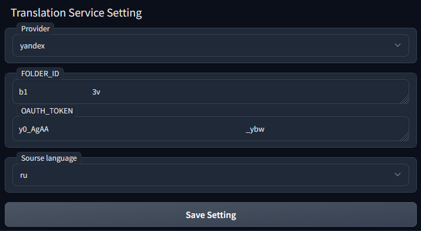
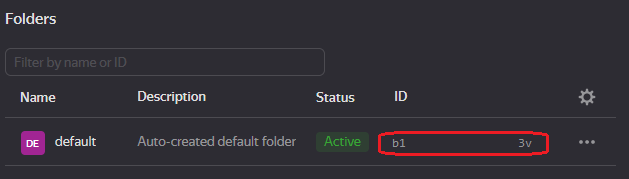

### Language
[中文](README.cn.md)

# Stable-Diffusion-Webui-Prompt-Translator
This Stable-Diffusion-Webui's extension can translate prompt from your native language into English, so from now on, you can write prompt with your native language.

# Install
GO to SD webui's extension page, choose install from github url. Fill it with this project's url, click install.

(If you can not connect to github, you can just download this project as `.zip` file. Unzip it to `Your Stable-Diffusion-Webui/extensions` folder.)

Then, Reload Stable-Diffusion-Webui. Done. 

# How to use
## Set translation API Key
This extension uses Online AI translator service [Deepl.com](https://www.deepl.com), [Google](https://cloud.google.com/translate/docs/setup?hl=en) or [Baidu](http://api.fanyi.baidu.com/)(for Chinese)'s API to translate your pormpt.  

That means, you need go to those translation website, apply a free API Key for this. Fill your API Key to this extension's tab page, click save, done.

(For baidu, check [README.cn.md](README.cn.md))

### Setup for Deepl
With deepl, it offers you 500,000 character/month for free. That's more than enough.  

After applying the API, go to your acount, the API key is at the bottom like following:
  

After you get your APP Key, fill it into this extension's tab page, then click save. 

### Setup for Google translation API Key [check](https://cloud.google.com/translate/docs/setup?hl=en)
**Note: Google API does not offer any free words per month, and setup is kind of complex for normal user. Only choose google when you can not use other service.**  

1. create GCP project([check](https://cloud.google.com/resource-manager/docs/creating-managing-projects?hl=en))
2. enable "Cloud Translation API" 
    - search "translation" 
    - click "Cloud Translation API"
    - click "ENABLE"
3. create "API Key"
    - after "Cloud Translation API" click "MANAGE"
    - select PROEJCT, and godo "API/Service Details" 
    - click "CREDENTIALS" tab and click "CREATED CREDENTIALS"

If you are in China, just choose [Baidu](http://api.fanyi.baidu.com/). 

### Setup for Yandex translation API  [check](https://cloud.yandex.com/en/docs/translate/api-ref/authentication)
**Note: The Yandex API issues a grant for new users and it is limited in time, and further translation is paid.**  

1. Get an OAuth token from Yandex.OAuth.
     - Click the [link](https://oauth.yandex.com/authorize?response_type=token&client_id=1a6990aa636648e9b2ef855fa7bec2fb) If the application requests access to data, grant it. This is required to get a token.
    
2. Get [folder ID](https://cloud.yandex.com/en/docs/resource-manager/operations/folder/get-id)
     - Select the folder on the management console [home page](https://console.cloud.yandex.com/cloud). This page displays information about all the folders in the selected cloud. If necessary, [switch to another cloud](https://cloud.yandex.com/en/docs/resource-manager/operations/cloud/switch-cloud).
     - You can retrieve the folder ID from the folder page URL in the management console
     `https://console.cloud.yandex.com/folders/b1gd129pp9ha0vnvf5g7`
        Where **b1gd129pp9ha0vnvf5g7** is the folder ID.

**Now, you have 2 ways to translate your prompt:**

## Use extension tab

You fill prompt at left side, click translate button, Translated English will be filled to right side.  

You can adujust both of them, then click "Send" button, to send translated English prompt to txt2img and img2img page's prompt.  

Works on negative prompt too.  

## Use the toolbar in txt2img/img2img page
With this toolbar, you can directly translate prompt in txt2img/img2img page, without going to extension page.

Move your mouse onto those buttons, they will show tooltips. Like following:
* Translate Prompt  
  
* Translate Negative Prompt  
  
* Switch prompt between your native language and translated English  
  
  
* The "**d**" button is a link to open [Deepl.com](https://www.deepl.com) in a new tab. In case you don't want to apply an APP Key, you still can use it on its website.

### Usecase
For example,  we filled prompt with asian language, then click "Translate" button. 
  

It will translate your prompt then fill translated words back. And save your native language prompt into memory.  
  

You can click switch button to switch between your native language prompt and translated English as you wish.  
  

Now, you can use the translated English for generating. 

Following is generated images with AI translated English.
  

If you go to img2img, you need to check the checkbox on toolbar. Otherwise this extension can not know which tab is active. And check it to off, after you're back to txt2img tab. 

  

Enjoy!  

# Tip
## Translate one word
Sometime, we've already set prompt in English, then just want to add one word with native language.  

In that case, we can fill that word into negative prompt, translate it, then cut&paste it back to prompt.   

## Security of API Key
If your App key is leaked to other people, you can go to Deepl/Baidu, delete that key and create a new one.    

